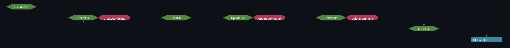

[][license]

# FileHandler

## Description
The class can create, read, upload and delete files in different ways.

## Dependency
**Maven:**
```xlm
<dependency>
    <groupId>github.magyarzoli</groupId>
    <artifactId>filehandler</artifactId>
    <version>1.0.0</version>
</dependency>
```

## Feature
**Creating:**
- Create the file, if it exists create it again with a new name which is an extended version of the original name.
- Create the file, if it exists it will overwrite the existing file.
- Before creating the file, it checks if there is a file with that name, if there is, it does not create the file.
- And other future implementation for creating.

**Reading:**
- Read lines from a file and populates three different data structures Array, Collection, Map.

**Updating:**
- Update the file to the starting content, keeping any additional existing content.
- Update the file to the ending content, keeping any additional existing content.
- Update the file, overwriting its contents.
- And other future implementation for updating.

**Deleting:**
- Delete file, and then create a new file.
- Delete file.
- And other future implementation for deleting.

## Hierarchy


### Authors
Magyar Zoltán

### Contact
magyarz95@gmail.com

[license]: https://www.apache.org/licenses/LICENSE-2.0